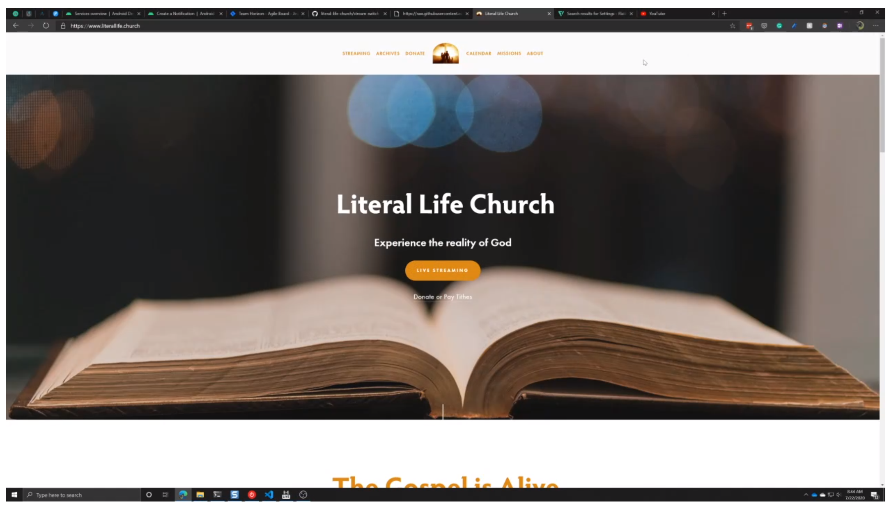
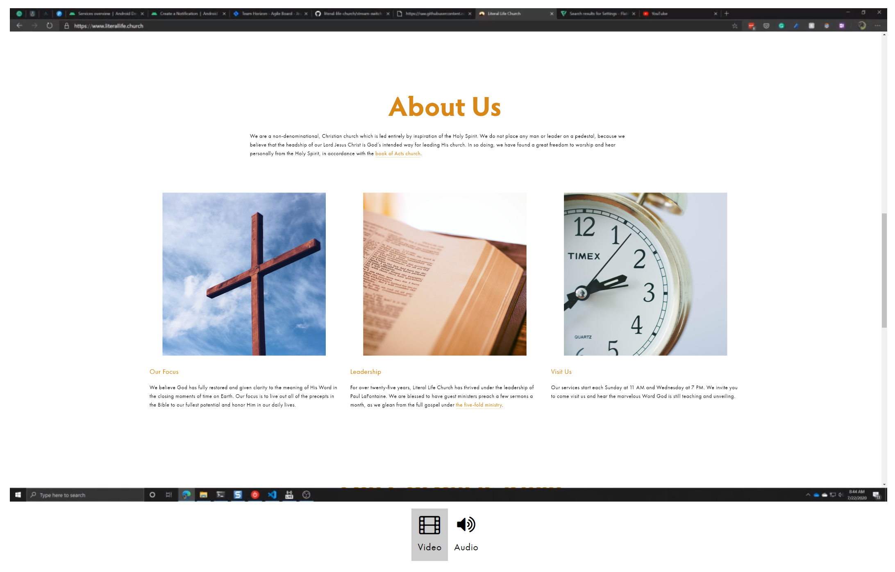
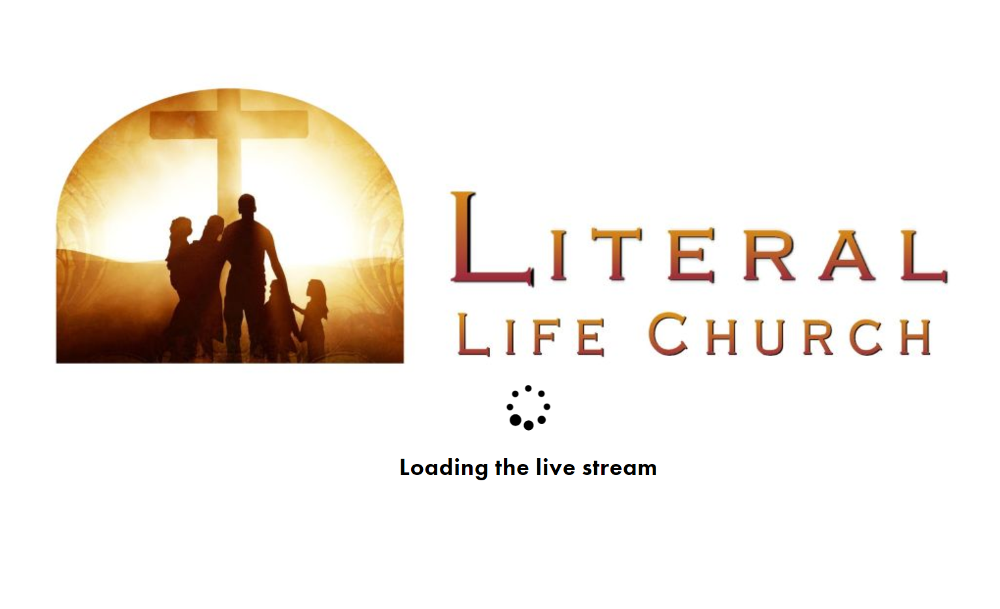
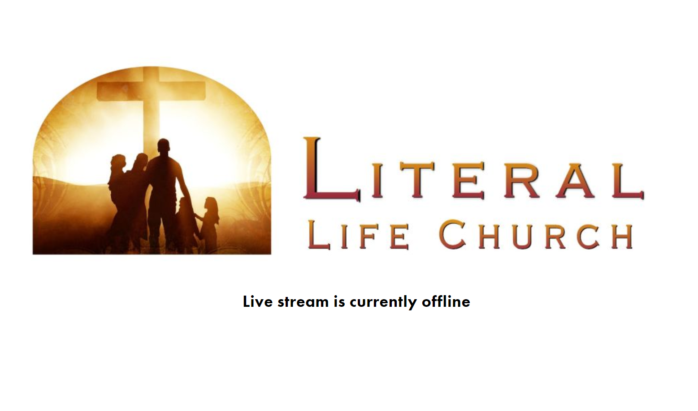

<div align="center">

<br>

<h1>Stream Switch<br/><sub>View and switch between a video and audio live streaming event</sub></h1>

[:one: API](https://github.com/literal-life-church/live-streaming-api/) |
[:two: Controller](https://github.com/literal-life-church/live-streaming-controller/) |
<strong>[:three: Player](https://github.com/literal-life-church/stream-switch/)</strong>

```text
"Streamlining the process to get your events online."
```

[](https://www.jsdelivr.com/package/gh/literal-life-church/stream-switch)
[](https://codeclimate.com/github/literal-life-church/stream-switch/maintainability)
[](https://www.codacy.com/gh/literal-life-church/stream-switch)
[](https://stream-switch.now.sh/)
[](https://github.com/literal-life-church/stream-switch/releases)

<hr />
</div>

## Project Introduction

The Stream Switch is a subset of a three-part application designed to view a stream of one or more live events on [Azure Media Services](https://azure.microsoft.com/en-us/services/media-services/). These parts are:

1.  **[Live Streaming API](https://github.com/literal-life-church/live-streaming-api/):** Turn on or off one more live events on Azure Media Services
2.  **[Live Streaming Controller](https://github.com/literal-life-church/live-streaming-controller):** A simple tool for the event broadcaster to interface with the Live Streaming API
3.  **[Stream Switch](https://github.com/literal-life-church/stream-switch):** A front-end, viewer application for viewing one or more live streams on a website

In production, an event broadcaster would use the Live Streaming Controller as a front-end application to make a `POST` call to the `/broadcaster` endpoint, a `DELETE` call to the `/broadcaster`, and a `GET` call to the `/broadcaster` endpoint on the Live Streaming API to respectively start the streaming services at the beginning of an event, stop the services at the end, and read the status of these resources at any point before, during, or after. All of these calls are authenticated, since they can reveal sensitive information about the state of your resources, or result in a state change, and thus a billing change, on the broadcaster's Azure account.

A viewer would then go to a website which has the Stream Switch installed to view the event. That application calls the `/locators` endpoint to fetch the streaming URLs from Azure to play inside of an HTML5 video player on the web. Since this endpoint intended for public consumption, it is the only endpoint in the API which is not authenticated.

This portion of the application trio focuses on delivering the live streams to an audience. The Stream Switch is designed to pull up to two live streams from the Live Streaming API, and whenever the events are online, display them in a JW Player video widget. This switching mechanism is intended to allow the viewer to watch the same event in two different ways, in one way as a video, and in another way as an audio-only stream to save on internet bandwidth usage. If the broadcaster is only streaming one of these events, such as the video event, and decided not to broadcast the audio-only version, then the switcher is smart enough to show only the available stream, and hide the button to view the offline audio stream.

---

<div align="center">

</div>

## Installation

Whenever a website administrator is setting up the Stream Switch widget, there are several necessary steps to get the application up and running.

### Set up the Backend and Live Events

This application is not able to run on its own, and requires a backend service to supply it with information.

1.  Set up the Live Streaming API, per [the installation steps](https://github.com/literal-life-church/live-streaming-api#installation) detailed in that project. This API serves as the data source for providing the live event streaming URLs to the Stream Switch.
2.  Create two live events on Azure Media services, one for a video stream and another for an audio (or low-quality video) stream
3.  Set up your video broadcasting software to simultaneously stream both a video and an audio (or low-quality video) stream at the same time. [Wirecast](https://www.telestream.net/wirecast/) is an example of an application which is capable of that.

### Sign up for Third-Party Services

[JW Player](https://www.jwplayer.com/) is the underlying technology which powers the viewer experience once at least one of your streams comes online. Analytics about your events is then captured via [Google Analytics](https://analytics.google.com/).

1.  Go to the [JW Player](https://www.jwplayer.com/) website and sign up for an account. It is preferable to purchase one of their plans since detailed player analytics will NOT be captured on the free plan.

2.  Inside of their account dashboard, create a video player and customize it to your liking

3.  Once the video player is customized, save the embed URL. The URL looks something like this:

    ```text
    https://cdn.jwplayer.com/libraries/XXXXXXXXX.js
    ```

4.  Go to the [Google Analytics](https://analytics.google.com/) and sign up for an account

5.  Create an analytics Account, Property, and View, as desired for your website

6.  Once the property is created, go to Admin &gt; Property &gt; Tracking Info &gt; Tracking Code. Make a note of this embed code. It looks something like this:

    ```html
    <!-- Global site tag (gtag.js) - Google Analytics -->
    <script async src="https://www.googletagmanager.com/gtag/js?id=UA-XXXXXXXX-1"></script>
    <script>
        window.dataLayer = window.dataLayer || [];
        function gtag(){dataLayer.push(arguments);}
        gtag('js', new Date());

        gtag('config', 'UA-XXXXXXXX-1');
    </script>
    ```

### Install the Stream Switch

Now that all of the pre-requisite steps are complete, the widget can be installed. For this section, you'll need a few version numbers so that your installation uses the latest version of several supporting libraries. Here is the table of each library, and their associated latest release version:

|                              Library Name                             | Find String |                                                             Replace With                                                            |
|:---------------------------------------------------------------------:|:-----------:|:-----------------------------------------------------------------------------------------------------------------------------------:|
|                [Axios](https://github.com/axios/axios)                |  `AA.AA.AA` |                                          |
|                 [VueJS](https://github.com/vuejs/vue)                 | `BB.BB.BB`  |                                            |
| [Stream Switch](https://github.com/literal-life-church/stream-switch) | `CC.CC.CC`  |  |

Whenever you install the Stream Switch in step 3, look for the strings in the **Find String** column and then use the corresponding value in the **Replace With** column. **Make sure to drop the `v` from the version number. For example, if the latest version of a library is `v3.0.0`, then use `3.0.0` instead.**

1.  Open the webpage which will contain the video player in an edtior

2.  In the `<head>` section of your webpage, add:

    ```html
    <link href="https://cdn.jsdelivr.net/npm/font-awesome@4.7.0/css/font-awesome.min.css" rel="stylesheet" type="text/css">

    <!-- Your Google Analytics script here -->
    <script async src="https://www.googletagmanager.com/gtag/js?id=UA-XXXXXXXX-1"></script>
    <script>
        window.dataLayer = window.dataLayer || [];
        function gtag(){dataLayer.push(arguments);}
        gtag('js', new Date());

        gtag('config', 'UA-XXXXXXXX-1');
    </script>
    ```

3.  In the body of the web page, where you plan on showing the video player, place the following code. Replace the placeholder versions as described in the table above. Also, customize the properties of the `<stream-switch />` widget to your organization's needs. Look at the table below to understand each property and its usage.

    ```html
    <div id="stream-switch">
      <stream-switch
        azure-audio-live-event-label="Audio"
        azure-audio-live-event-name="audio"
        azure-streaming-endpoint-name="default"
        azure-video-live-event-label="Video"
        azure-video-live-event-name="video"
        live-streaming-api-host="livestreamingapi.mychurch.com"
        loading-text="Loading the live stream"
        offline-text="Live stream is currently offline"
        organization-name="My Church Name"
        placeholder-image="https://place-hold.it/1000x500"
        polling-interval="45" />
    </div>

    <!-- Your JW Player script here -->
    <script src="https://cdn.jwplayer.com/libraries/XXXXXXXX.js"></script>
    <!-- Replace versions below with values from table up above -->
    <script src="https://cdn.jsdelivr.net/combine/npm/axios@AA.AA.AA/dist/axios.min.js,npm/vue@BB.BB.BB/dist/vue.min.js,gh/literal-life-church/stream-switch@CC.CC.CC/stream-switch.min.js"></script>

    <script type="text/javascript">
        document.addEventListener("DOMContentLoaded", function(event) {       
            new Vue({
                el: "#stream-switch"
            });
        });
    </script>
    ```

4.  Save the web page and reload. The widget will show a pre-loader will fetching the streaming information, an offline message whenever both streams are offline, and will play the stream automatically if at least one stream is live.

## Customization

Here is a collection of all of the properties on the Stream Switch which can be used to change its behavior.

|             Property            |               Default              |   Type  |      Required      |                                                                                                                                            Description                                                                                                                                           |
|:-------------------------------:|:----------------------------------:|:-------:|:------------------:|:------------------------------------------------------------------------------------------------------------------------------------------------------------------------------------------------------------------------------------------------------------------------------------------------:|
| `autoplay`                      | `true`                             | Boolean |         :x:        | Whether or not the stream plays automatically on load. Sometimes, the browser suppresses autoplay when set to                                                                                                                                                                                    |
| `azure-audio-live-event-label`  | &lt;empty&gt;                      | String  | :heavy_check_mark: | Name to show as the button label for the audio stream                                                                                                                                                                                                                                            |
| `azure-audio-live-event-name`   | &lt;empty&gt;                      | String  | :heavy_check_mark: | Name of the Live Event on Azure Media Services for the audio stream                                                                                                                                                                                                                              |
| `azure-streaming-endpoint-name` | &lt;empty&gt;                      | String  | :heavy_check_mark: | Name of the Streaming Endpoint on Azure Media Services                                                                                                                                                                                                                                           |
| `azure-video-live-event-label`  | &lt;empty&gt;                      | String  | :heavy_check_mark: | Name to show as the button label for the video stream                                                                                                                                                                                                                                            |
| `azure-video-live-event-name`   | &lt;empty&gt;                      | String  | :heavy_check_mark: | Name of the Live Event on Azure Media Services for the video stream                                                                                                                                                                                                                              |
| `live-streaming-api-host`       | &lt;empty&gt;                      | String  | :heavy_check_mark: | Domain name of the Live Streaming API configured for your Azure account. If the URL is `https://livestreamingapi.mychurch.com/`, use `livestreamingapi.mychurch.com`.                                                                                                                            |
| `loading-text`                  | `Loading the live stream`          | String  | :x:                | Text to show the viewer while the live streaming data is loaded from the Live Streaming API                                                                                                                                                                                                      |
| `offline-text`                  | `Live stream is currently offline` | String  | :x:                | Text to show the viewer whenever both the video and audio streams are offline                                                                                                                                                                                                                    |
| `organization-name`             | &lt;empty&gt;                      | String  | :heavy_check_mark: | Used to build the video name for use as metadata on mobile devices and desktops when showing the currently playing media                                                                                                                                                                         |
| `placeholder-image`             | &lt;empty&gt;                      | String  | :heavy_check_mark: | Background image used whenever loading the live streaming data or for whenever both streams are offline                                                                                                                                                                                          |
| `polling-interval`              | `0`                                | Number  | :x:                | Polls the Live Streaming API every X seconds whenever the streams are offline to see whenever they come online and automatically loads the stream into the player. Values less than `15` are ignored and effectively disable the polling interval. Omitting this property also disables polling. |

## Screenshots

In addition to the [online demo](https://stream-switch.now.sh/), here are a few screenshots of the application at work.

<div align="center">
<a href="./.docs/screenshots/one-stream.png"></a>
<a href="./.docs/screenshots/two-streams.png"></a>
<a href="./.docs/screenshots/loading.png"></a>
<a href="./.docs/screenshots/offline.png"></a>

<br><br>


</div>

<br><br>

---

<div align="center">
<br/><br/>

<br/>
<sub><i>This plugin was inspired by a need for the live streaming pipeline we use at <a href="https://www.literallife.church/" target="_blank">Literal Life Church</a></i></sub>
<br><br>

Contributors:<br><br>

[](https://sourcerer.io/fame/oliverspryn/literal-life-church/stream-switch/links/0)
[](https://sourcerer.io/fame/oliverspryn/literal-life-church/stream-switch/links/1)
[](https://sourcerer.io/fame/oliverspryn/literal-life-church/stream-switch/links/2)
[](https://sourcerer.io/fame/oliverspryn/literal-life-church/stream-switch/links/3)
[](https://sourcerer.io/fame/oliverspryn/literal-life-church/stream-switch/links/4)
[](https://sourcerer.io/fame/oliverspryn/literal-life-church/stream-switch/links/5)
[](https://sourcerer.io/fame/oliverspryn/literal-life-church/stream-switch/links/6)
[](https://sourcerer.io/fame/oliverspryn/literal-life-church/stream-switch/links/7)

<br/>


<br/>
<br/>


</div>
